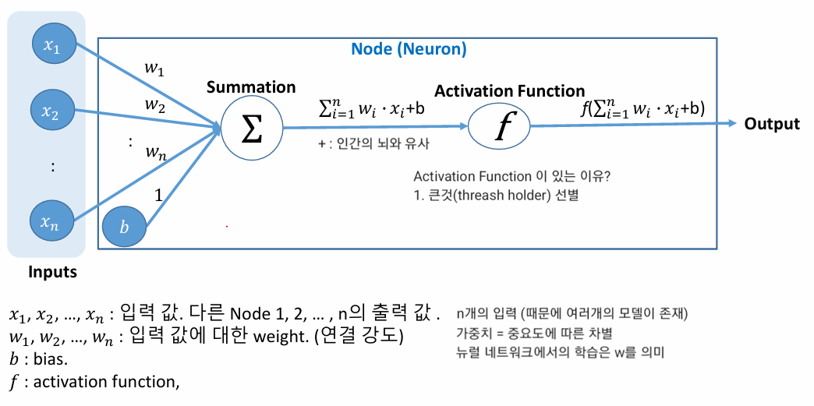

# NODE (Artificial Neuron)

    입력값 : 상수
    Activation Function : 상수
    Parameter(Bias포함) : 변수
        Hyper Parameter : 사람이 정해주는 값

 # Feedforward Network (Fully Connected Network)
    구성
    Input Layer - Hidden Layer - Output Layer

    Network가 여러개의 Layer로 구성
    하나의 Layer는 여러개의 node로 구성

    [인풋레이어]를 제외한 모든 레이어의 각 [노드]는 이전 레이어에 속하는 모든 노드의 [출력]을 [입력]으로 받음
